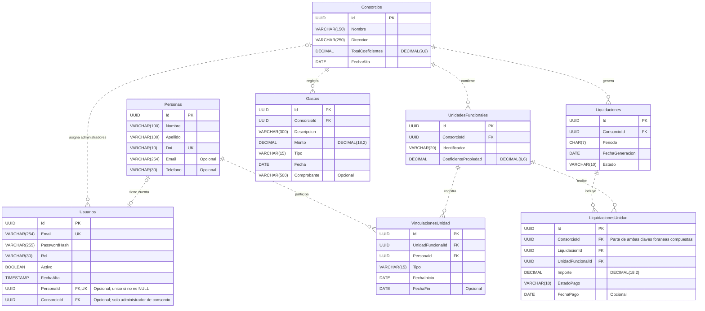

# Diagrama entidad-relación

**Proyecto:** Sistema de Administración de Consorcios  
**Trabajo Final Integrador — Grupo 128**  
**Entrega:** Segunda entrega  
**Base de datos:** PostgreSQL · esquema `dbo`

El diagrama representa las ocho tablas del archivo `schema-consorcios.sql`. Incluye campos, tipos de datos, claves y relaciones. Los índices y las claves compuestas se detallan debajo.

## 1. Diagrama

## 2. Cómo leer el diagrama

- **PK:** clave primaria, identifica cada registro.
- **FK:** clave foránea, relaciona tablas.
- **UK:** valor único. Las combinaciones de campos únicos se indican en la sección siguiente.
- **Opcional:** el campo admite `NULL`. Los demás campos son obligatorios.
- **`||`:** exactamente uno; **`o|` / `|o`:** cero o uno; **`o{`:** cero o muchos.
- Las líneas discontinuas indican relaciones no identificadoras: cada tabla tiene su propia clave primaria `Id`.

Una persona puede tener varias vinculaciones con unidades, pero como máximo una cuenta de usuario. Un usuario puede no tener persona o consorcio asignado; el esquema solo permite asignar `ConsorcioId` a usuarios con rol `ADMINISTRADOR_CONSORCIO`.

## 3. Claves únicas y relaciones compuestas

Además de las claves primarias, el esquema define las siguientes restricciones de unicidad:

| Tabla | Campos únicos |
|---|---|
| Personas | `Dni` |
| Usuarios | `Email` |
| Usuarios | `PersonaId`, cuando no es `NULL` |
| UnidadesFuncionales | `(ConsorcioId, Identificador)` |
| UnidadesFuncionales | `(Id, ConsorcioId)` |
| Liquidaciones | `(ConsorcioId, Periodo)` |
| Liquidaciones | `(Id, ConsorcioId)` |
| LiquidacionesUnidad | `(LiquidacionId, UnidadFuncionalId)` |

En `LiquidacionesUnidad`, las relaciones usan **dos campos en conjunto**:

| Campos de origen | Tabla y campos de destino |
|---|---|
| `(LiquidacionId, ConsorcioId)` | `Liquidaciones (Id, ConsorcioId)` |
| `(UnidadFuncionalId, ConsorcioId)` | `UnidadesFuncionales (Id, ConsorcioId)` |

Estas claves garantizan que la liquidación y la unidad pertenezcan al mismo consorcio. No existe una clave foránea independiente desde `LiquidacionesUnidad.ConsorcioId` hacia `Consorcios`.

## 4. Índices principales

Las claves primarias y las restricciones `UNIQUE` generan sus propios índices. Además, el SQL declara los siguientes:

| Índice | Tabla | Campos y condición |
|---|---|---|
| UX_Usuarios_PersonaId | Usuarios | Único sobre `PersonaId`, donde `PersonaId IS NOT NULL`. |
| IX_Usuarios_ConsorcioId | Usuarios | `ConsorcioId`, donde `ConsorcioId IS NOT NULL`. |
| IX_Vinc_UF | VinculacionesUnidad | `(UnidadFuncionalId, Tipo)`. |
| IX_Vinc_Persona | VinculacionesUnidad | `PersonaId`. |
| IX_Gastos_Consorcio_Fecha | Gastos | `(ConsorcioId, Fecha DESC)`. |
| IX_LiqUF_UF_Estado | LiquidacionesUnidad | `(UnidadFuncionalId, EstadoPago)`. |
| IX_LiqUF_Pendientes | LiquidacionesUnidad | `ConsorcioId`, donde `EstadoPago = 'PENDIENTE'`. |

## 5. Restricciones principales del esquema

- **Usuarios:** roles `SUPERADMINISTRADOR`, `ADMINISTRADOR_CONSORCIO`, `PROPIETARIO` o `INQUILINO`.
- **Consorcios:** total de coeficientes mayor que cero.
- **Unidades:** coeficiente mayor que cero y menor o igual a 100.
- **Vinculaciones:** tipo `PROPIETARIO` o `INQUILINO`; la fecha de fin, si existe, no puede ser anterior a la de inicio. Al eliminar una unidad, se eliminan sus vinculaciones.
- **Gastos:** monto mayor que cero y tipo `ORDINARIO` o `EXTRAORDINARIO`.
- **Liquidaciones:** estado `ABIERTA` o `CERRADA`.
- **Liquidaciones por unidad:** importe mayor o igual a cero y estado de pago `PENDIENTE` o `PAGADO`.

Este documento representa el esquema actual; las reglas de negocio que no están expresadas en el SQL deberán implementarse en la aplicación.
