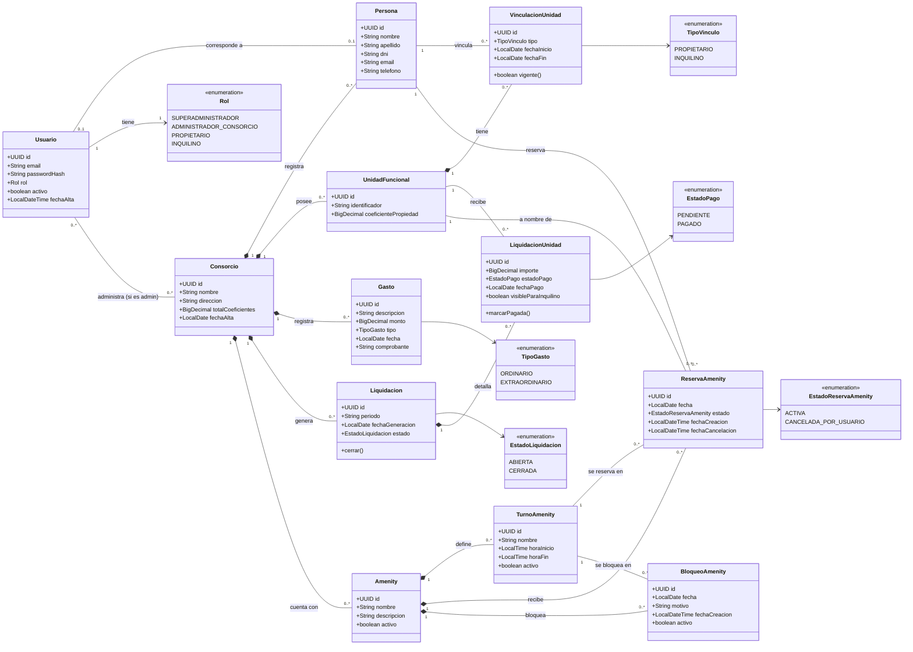

# Diagrama de clases - Modelo de dominio

```mermaid
classDiagram
    direction LR

    class Usuario {
        +UUID id
        +String email
        +String passwordHash
        +Rol rol
        +boolean activo
        +LocalDateTime fechaAlta
    }

    class Persona {
        +UUID id
        +String nombre
        +String apellido
        +String dni
        +String email
        +String telefono
    }

    class Consorcio {
        +UUID id
        +String nombre
        +String direccion
        +BigDecimal totalCoeficientes
        +LocalDate fechaAlta
    }

    class UnidadFuncional {
        +UUID id
        +String identificador
        +BigDecimal coeficientePropiedad
    }

    class VinculacionUnidad {
        +UUID id
        +TipoVinculo tipo
        +LocalDate fechaInicio
        +LocalDate fechaFin
        +boolean vigente()
    }

    class Gasto {
        +UUID id
        +String descripcion
        +BigDecimal monto
        +TipoGasto tipo
        +LocalDate fecha
        +String comprobante
    }

    class Liquidacion {
        +UUID id
        +String periodo
        +LocalDate fechaGeneracion
        +EstadoLiquidacion estado
        +cerrar()
    }

    class LiquidacionUnidad {
        +UUID id
        +BigDecimal importe
        +EstadoPago estadoPago
        +LocalDate fechaPago
        +boolean visibleParaInquilino
        +marcarPagada()
    }

    class Rol {
        <<enumeration>>
        SUPERADMINISTRADOR
        ADMINISTRADOR_CONSORCIO
        PROPIETARIO
        INQUILINO
    }

    class TipoVinculo {
        <<enumeration>>
        PROPIETARIO
        INQUILINO
    }

    class TipoGasto {
        <<enumeration>>
        ORDINARIO
        EXTRAORDINARIO
    }

    class EstadoLiquidacion {
        <<enumeration>>
        ABIERTA
        CERRADA
    }

    class EstadoPago {
        <<enumeration>>
        PENDIENTE
        PAGADO
    }

    class Amenity {
        +UUID id
        +String nombre
        +String descripcion
        +boolean activo
    }

    class TurnoAmenity {
        +UUID id
        +String nombre
        +LocalTime horaInicio
        +LocalTime horaFin
        +boolean activo
    }

    class ReservaAmenity {
        +UUID id
        +LocalDate fecha
        +EstadoReservaAmenity estado
        +LocalDateTime fechaCreacion
        +LocalDateTime fechaCancelacion
    }

    class BloqueoAmenity {
        +UUID id
        +LocalDate fecha
        +String motivo
        +LocalDateTime fechaCreacion
        +boolean activo
    }

    class EstadoReservaAmenity {
        <<enumeration>>
        ACTIVA
        CANCELADA_POR_USUARIO
    }

    Usuario "0..1" -- "0..1" Persona : corresponde a
    Usuario "1" --> "1" Rol : tiene
    Usuario "0..*" -- "0..*" Consorcio : administra (si es admin)

    Consorcio "1" *-- "0..*" Persona : registra
    Consorcio "1" *-- "0..*" UnidadFuncional : posee
    Consorcio "1" *-- "0..*" Gasto : registra
    Consorcio "1" *-- "0..*" Liquidacion : genera

    UnidadFuncional "1" *-- "0..*" VinculacionUnidad : tiene
    Persona "1" -- "0..*" VinculacionUnidad : vincula
    VinculacionUnidad --> TipoVinculo

    Gasto --> TipoGasto

    Liquidacion --> EstadoLiquidacion
    Liquidacion "1" *-- "0..*" LiquidacionUnidad : detalla
    UnidadFuncional "1" -- "0..*" LiquidacionUnidad : recibe
    LiquidacionUnidad --> EstadoPago

    Consorcio "1" *-- "0..*" Amenity : cuenta con
    Amenity "1" *-- "0..*" TurnoAmenity : define
    Amenity "1" *-- "0..*" ReservaAmenity : recibe
    Amenity "1" *-- "0..*" BloqueoAmenity : bloquea
    TurnoAmenity "1" -- "0..*" ReservaAmenity : se reserva en
    TurnoAmenity "1" -- "0..*" BloqueoAmenity : se bloquea en
    Persona "1" -- "0..*" ReservaAmenity : reserva
    UnidadFuncional "1" -- "0..*" ReservaAmenity : a nombre de
    ReservaAmenity --> EstadoReservaAmenity
```
