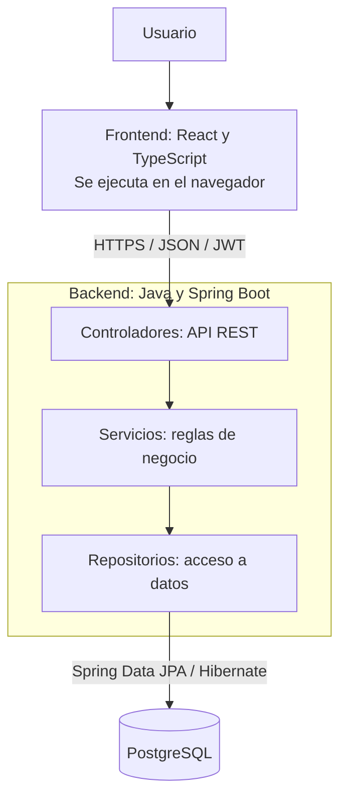

# Arquitectura del proyecto

**Proyecto:** Sistema de Administración de Consorcios  
**Trabajo Final Integrador — Grupo 128**  
**Entrega:** Segunda entrega

## 1. Arquitectura elegida

El sistema utilizará una **arquitectura cliente-servidor**, con un frontend web independiente y un **backend monolítico organizado en capas**.

El frontend permitirá a los usuarios interactuar con el sistema. El backend concentrará la seguridad, las reglas de negocio y el acceso a PostgreSQL. Los módulos funcionales formarán parte de una misma aplicación backend.

Esta organización resulta adecuada para el tamaño del proyecto y del equipo: permite separar responsabilidades, desarrollar por módulos y mantener centralizados los permisos y las operaciones sobre los datos.

## 2. Diagrama general



Las solicitudes protegidas se verificarán mediante Spring Security antes de ejecutar las operaciones correspondientes. El frontend se comunicará con la base de datos a través del backend.

## 3. Tecnologías elegidas

| Componente | Tecnología | Uso y justificación |
|---|---|---|
| Interfaz web | React y TypeScript | Construcción de pantallas y componentes reutilizables, con tipos que ayudan a detectar errores durante el desarrollo. |
| Herramienta de desarrollo del frontend | Vite | Preparación del entorno de desarrollo y generación de los archivos de la aplicación web. |
| Estilos | Tailwind CSS | Definición de una interfaz adaptable a distintos tamaños de pantalla y con estilos consistentes. |
| Navegación | React Router | Organización de las rutas y pantallas de la aplicación. |
| Consultas al backend | TanStack Query | Gestión de consultas, estados de carga y actualización de datos después de las operaciones. |
| Formularios | React Hook Form | Gestión de los formularios de carga y edición de información. |
| Backend | Java y Spring Boot | Desarrollo de la aplicación que centraliza las reglas de negocio y expone los servicios del sistema. |
| API | Spring Web | Implementación de una API REST con intercambio de datos en formato JSON. |
| Persistencia | Spring Data JPA e Hibernate | Acceso a PostgreSQL y relación entre las entidades de Java y las tablas. |
| Seguridad | Spring Security y JWT | Autenticación de usuarios y control de acceso a las operaciones. |
| Validaciones | Bean Validation | Validación de los datos recibidos por la API. |
| Base de datos | PostgreSQL | Almacenamiento relacional con claves, restricciones y transacciones para mantener la consistencia de la información. |
| Versionado | Git y GitHub | Control de cambios, colaboración del equipo y almacenamiento de la documentación. |
| Pruebas de la API | Postman | Comprobación de solicitudes, respuestas y permisos durante el desarrollo. |

## 4. Organización del backend

| Capa o componente | Responsabilidad |
|---|---|
| Controladores (`controller`) | Recibir las solicitudes HTTP, validar su estructura y devolver las respuestas de la API. |
| Servicios (`service`) | Aplicar las reglas de negocio, comprobar los permisos sobre los datos y coordinar las transacciones. |
| Repositorios (`repository`) | Consultar y guardar información en PostgreSQL. |
| Entidades (`entity`) | Representar los datos persistentes del sistema. |
| Objetos de transferencia (`dto`) | Definir los datos de entrada y salida de la API, evitando exponer información interna o sensible. |
| Seguridad (`security`) | Configurar la autenticación y las restricciones de acceso. |

El flujo principal será: **controlador → servicio → repositorio → base de datos**.

Los servicios concentrarán reglas como la validación de los coeficientes, el cálculo de expensas, el cierre de liquidaciones y la marcación de pagos. Las operaciones que deban completarse juntas, como la creación de una liquidación y sus importes por unidad, se ejecutarán dentro de una transacción.

## 5. Seguridad y consistencia de datos

- Las contraseñas se almacenarán mediante un hash seguro, nunca como texto legible.
- El inicio de sesión emitirá un JWT para identificar al usuario en las solicitudes protegidas.
- El backend verificará tanto el rol como la relación del usuario con el consorcio o la unidad solicitada.
- Las restricciones de acceso se aplicarán en el backend; ocultar una opción en la interfaz será únicamente una ayuda de navegación.
- Las claves foráneas y restricciones del esquema protegerán las relaciones entre consorcios, unidades, personas y liquidaciones.
- Los importes se calcularán con `BigDecimal` en Java y se almacenarán como `DECIMAL` en PostgreSQL.
- Las credenciales de conexión y las claves de seguridad se configurarán mediante variables de entorno y quedarán fuera del repositorio.

El esquema de datos será la referencia para configurar las entidades y sus relaciones en el backend.

## 6. Estructura objetivo del repositorio

```text
/
├── frontend/
│   └── src/
│       ├── components/       Componentes reutilizables
│       ├── pages/            Pantallas de la aplicación
│       ├── services/         Comunicación con la API
│       └── types/            Tipos de datos compartidos
├── backend/
│   └── src/main/
│       ├── java/<paquete-base>/
│       │   ├── controller/
│       │   ├── service/
│       │   ├── repository/
│       │   ├── entity/
│       │   ├── dto/
│       │   └── security/
│       └── resources/        Configuración de la aplicación
├── database/
│   ├── schema-consorcios.sql
│   ├── diagrama-entidad-relacion.md
│   └── uml-modelo-dominio.md
├── docs/
│   ├── modulos.md
│   └── arquitectura.md
├── Entrega_1.md
└── README.md
```

Esta estructura describe la organización que se completará al inicializar las aplicaciones. `<paquete-base>` representa el paquete Java que utilizará el equipo.

## 7. Despliegue previsto

| Componente | Servicio elegido | Responsabilidad |
|---|---|---|
| Frontend | Vercel | Publicar los archivos de la aplicación React. |
| Backend | Railway | Ejecutar la aplicación Spring Boot y exponer la API. |
| Base de datos | Supabase | Alojar PostgreSQL, al que se conectará el backend. |

La autenticación estará a cargo de Spring Security y JWT en el backend. Supabase se utilizará como alojamiento de PostgreSQL.

Antes de publicar se verificarán las condiciones y los recursos disponibles en los servicios elegidos. Esta planificación no presupone que el despliegue completo sea gratuito.

## 8. Documentación relacionada

- [Propuesta y alcance de la primera entrega](../Entrega_1.md).
- [Módulos funcionales y prioridades](modulos.md).
- [Esquema de base de datos](../database/schema-consorcios.sql).
- [Diagrama entidad-relación](../database/diagrama-entidad-relacion.md).
- [Diagrama de clases del modelo de dominio](../database/uml-modelo-dominio.md).

PRUEBA VS CODE